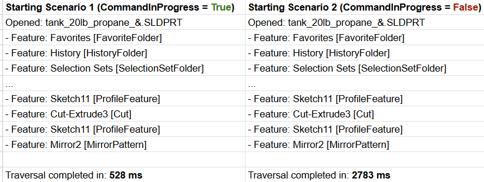

# Command In Progress Results

The code example traverses the tree of features in a SolidWorks part file (`tank_20lb_propane_&.SLDPRT`) and records the time taken to complete the traversal under two different scenarios.

## Scenario 1: CommandInProgress = True

- Opened: `tank_20lb_propane_&.SLDPRT`
- Feature: Favorites [FavoriteFolder]
- Feature: History [HistoryFolder]
- Feature: Selection Sets [SelectionSetFolder]
- ...
- Feature: Sketch11 [ProfileFeature]
- Feature: Cut-Extrude3 [Cut]
- Feature: Sketch11 [ProfileFeature]
- Feature: Mirror2 [MirrorPattern]

Traversal completed in: 528 ms

## Scenario 2: CommandInProgress = False

- Opened: `tank_20lb_propane_&.SLDPRT`
- Feature: Favorites [FavoriteFolder]
- Feature: History [HistoryFolder]
- Feature: Selection Sets [SelectionSetFolder]
- ...
- Feature: Sketch11 [ProfileFeature]
- Feature: Cut-Extrude3 [Cut]
- Feature: Sketch11 [ProfileFeature]
- Feature: Mirror2 [MirrorPattern]

Traversal completed in: 2783 ms

