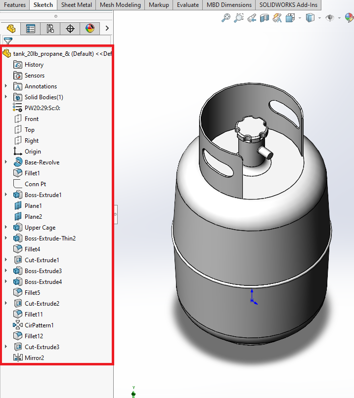
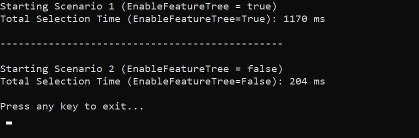

# EnableFeatureTree Results

The code example traverses the tree of features in a SolidWorks part file (`tank_20lb_propane_&.SLDPRT`) and records the time taken to complete the traversal under two different scenarios.

## Scenario 1: EnableFeatureTree = True
Total Selection Time (EnableFeatureTree=True): 1170 ms

## Scenario 2: EnableFeatureTree = False
Total Selection Time (EnableFeatureTree=False): 204 ms

