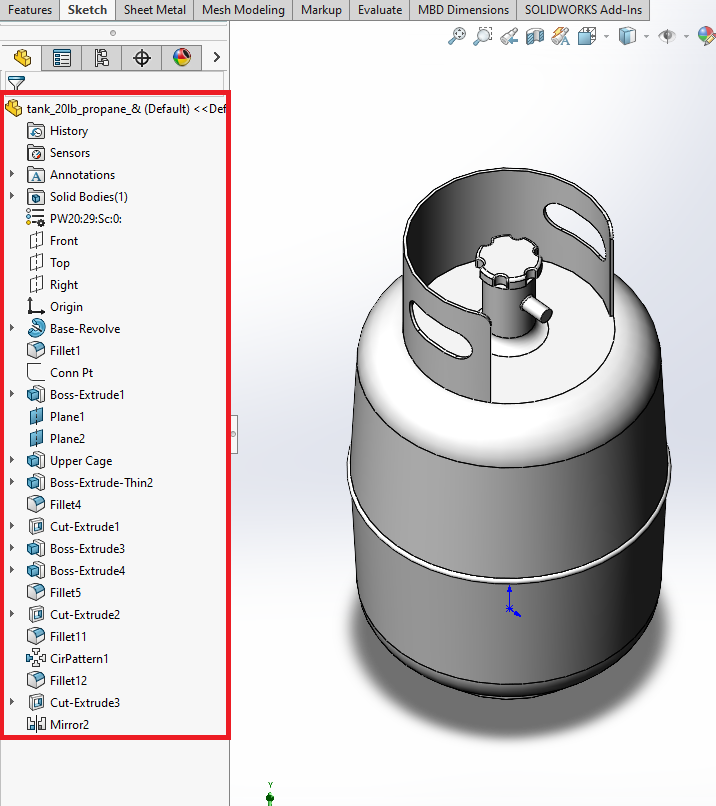
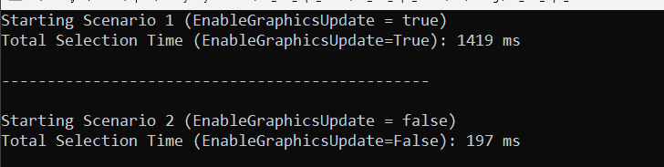

# EnableGraphicsUpdate Results

The code example traverses the tree of features in a SolidWorks part file (`tank_20lb_propane_&.SLDPRT`) and records the time taken to complete the traversal under two different scenarios.

## Scenario 1: EnableGraphicsUpdate = True
Total Selection Time (EnableGraphicsUpdate=True): 1419 ms

## Scenario 2: EnableGraphicsUpdate = False

Total Selection Time (EnableGraphicsUpdate=False): 197 ms

