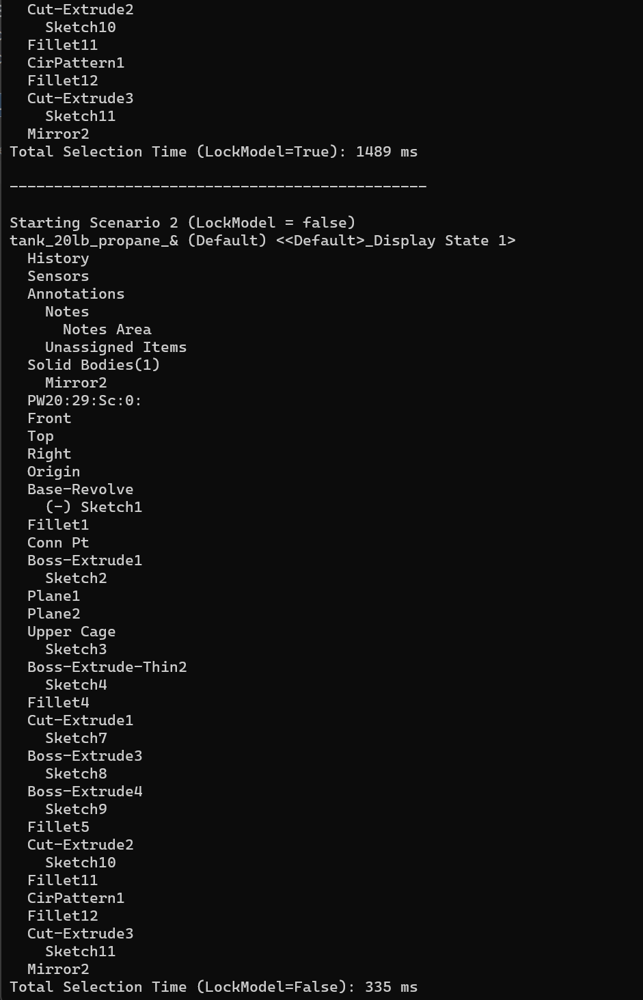

# LockModel Results

The code example traverses the tree of features in a SolidWorks part file (`tank_20lb_propane_&.SLDPRT`) and records the time taken to complete the traversal under two different scenarios.

## Scenario 1: LockModel = True
Total Selection Time (LockModel=True): 1489 ms

## Scenario 2: LockModel = False
Total Selection Time (LockModel=False): 335 ms

