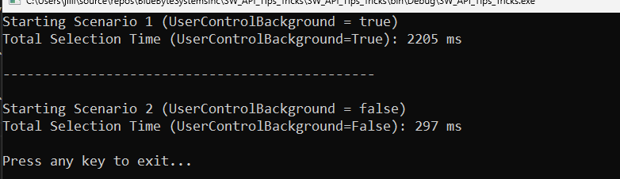

# UserControlBackground Results

The code example traverses the tree of features in a SolidWorks part file (`tank_20lb_propane_&.SLDPRT`) and records the time taken to complete the traversal under two different scenarios. When `UserControlBackground` is set to `false`, the user has **no** control over the SolidWorks application.

## Scenario 1: UserControlBackground = True
Total Selection Time (UserControlBackground=True): 2205 ms

## Scenario 2: UserControlBackground = False
Total Selection Time (UserControlBackground=False): 297 ms

